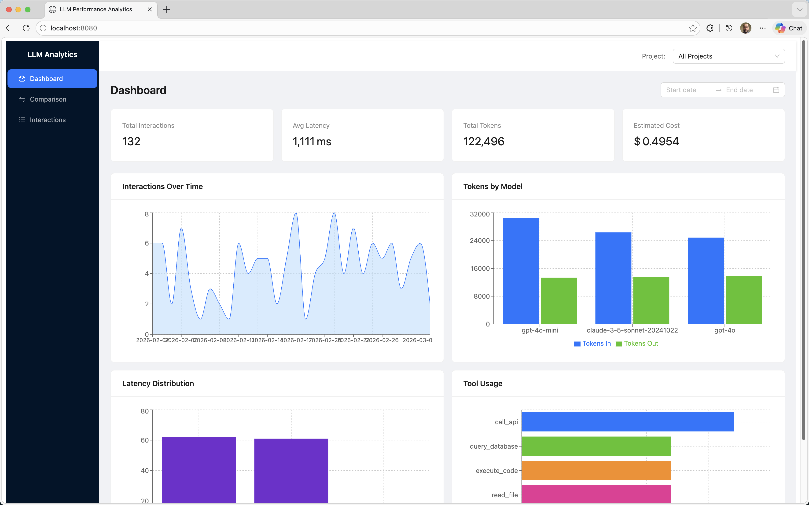

# LLM Performance Analytics Platform — spec-kit Demo

This project demonstrates end-to-end AI-assisted development using [spec-kit](https://github.com/github/spec-kit): starting from a blank directory, a fully implemented Spring Boot + React analytics platform was built entirely through structured agents in GitHub Copilot Chat. The steps below document exactly what was done — you can follow the same process to build your own project.

## Prerequisites

- [uv](https://docs.astral.sh/uv/) — Python package manager used to install spec-kit
- [VS Code](https://code.visualstudio.com/) with the [GitHub Copilot](https://marketplace.visualstudio.com/items?itemName=GitHub.copilot) extension

---

## Step 1 — Install spec-kit

```bash
uv tool install specify-cli --from git+https://github.com/github/spec-kit.git
```

## Step 2 — Initialize the project

This was run in the project directory:

```bash
specify init . --ai copilot
```

This scaffolded the spec-kit structure and installed the Copilot custom agents.

## Step 3 — Open in VS Code

```bash
code .
```

## Step 4 — How to select a spec-kit agent

All spec-kit agents are available in the Copilot Chat **Agent** mode. Open Copilot Chat, click the **Agent** dropdown (top-left of the chat input), and select the agent you want to invoke.

The agents available are:

| Agent | Purpose |
|---|---|
| `speckit.constitution` | Define project-wide principles and governance |
| `speckit.specify` | Generate a feature specification from a description |
| `speckit.clarify` | Ask targeted questions to tighten an existing spec |
| `speckit.plan` | Produce a technical design and implementation plan |
| `speckit.analyze` | Check consistency across spec, plan, and tasks |
| `speckit.tasks` | Generate a dependency-ordered task list |
| `speckit.checklist` | Produce a custom quality checklist |
| `speckit.implement` | Execute tasks from `tasks.md` |
| `speckit.taskstoissues` | Convert tasks into GitHub Issues |

---

## Step 5 — Establish project principles

The **`speckit.constitution`** agent was invoked with:

```
Create principles focused on code quality, testing standards, user experience
consistency, and performance requirements. Include governance for how these
principles should guide technical decisions and implementation choices.
```

This created `.specify/memory/constitution.md`, which all subsequent agents respected.

---

## Step 6 — Write the feature specification

The **`speckit.specify`** agent was invoked with:

```
Create a web-based platform that can be used to capture performance analysis
for LLM interactions / chats using prompt sent, tokens in, tokens out, time
started, time ended, tools called, etceteras. Make it possible to store
different iterations and make it possible to show graphs and all the other
relevant ways that one can determine performance. Include a REST API so results
can be uploaded. Include sample data so we can see how it would look like.
```

This created `specs/<feature>/spec.md`.

---

## Step 7 — Clarify the specification

The **`speckit.clarify`** agent was invoked with:

```
Execute
```

This asked up to 5 targeted questions to identify underspecified areas and encoded the answers back into the spec. See `specs/001-llm-perf-analytics/plan.md` for the resulting Q&As.

---

## Step 8 — Create the implementation plan

The **`speckit.plan`** agent was invoked with:

```
Use Spring Boot with an embedded React frontend using PostgreSQL and Docker compose
```

This created `specs/<feature>/plan.md` with a technical design tailored to the spec and the constitution.

---

## Step 9 — Generate the task list

The **`speckit.tasks`** agent was invoked with:

```
Execute
```

This created `specs/<feature>/tasks.md` with a dependency-ordered list of implementation tasks.

---

## Step 10 — Analyze consistency

The **`speckit.analyze`** agent was invoked with:

```
Execute
```

This performed a cross-artifact consistency check across `spec.md`, `plan.md`, and `tasks.md`. The agent identified gaps and offered to draft resolutions — both were accepted and applied.

> **Optional:** **`speckit.checklist`** can also be run at this stage to generate a custom quality checklist tailored to the feature.

---

## Step 11 — Implement

The **`speckit.implement`** agent was invoked with:

```
Execute
```

Large features are not always fully delivered in a single pass. For this project, two passes were needed:

**Pass 1** — `speckit.implement` was run with `Execute`. The agent completed a large portion of the tasks but reported completion prematurely.

**Pass 2** — `speckit.implement` was run again with `Execute`. The agent found failing tests and addressed them, then confirmed all tasks complete.

**Mop-up** — Additional agent-assisted Copilot work was needed to resolve runtime and integration issues stemming from context that was not provided to spec-kit upfront: JDK version, environment variable conventions, and API client configuration details. Providing that context in the plan prompt would have eliminated most of this work.

The number of passes will vary per project depending on scope and complexity.

---

## Result

The fully implemented LLM Performance Analytics Platform — a Spring Boot REST API with an embedded React dashboard, PostgreSQL persistence, Docker Compose deployment, and sample data — built from a one-sentence description in two implementation passes.


